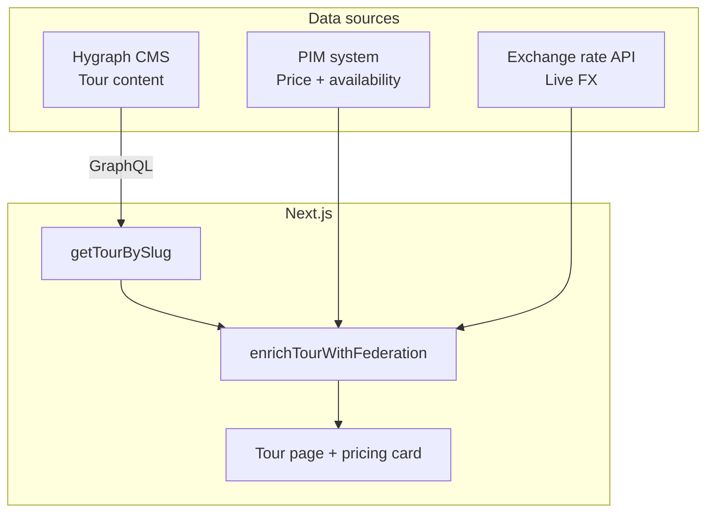
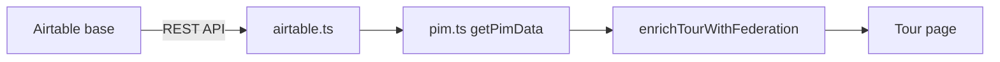

# Content Federation in Wandr

Hygraph for editorial content. PIM + live rates for commerce data. Joined at render time.

## The problem

Tour marketing content (copy, images, SEO) changes often and belongs in a CMS.

Pricing and availability change constantly and belong in operational systems (PIM, booking, inventory).

Duplicating prices in the CMS creates sync issues and stale data.

## The pattern



**One page, three sources — one merged tour object.**

## What lives where

| Source | Data | Key required? |
|---|---|---|
| **Hygraph** | Title, description, images, destination | Yes (`HYGRAPH_TOKEN`) |
| **PIM** | Base price, discounts, departure slots | No (mocked, or optional Airtable) |
| **Exchange rates** | EUR → USD, etc. | No (free public API) |

## The flow

1. User opens `/tours/kyoto-culture-5d`
2. App fetches tour content from **Hygraph**
3. App looks up pricing + availability from the **PIM** (by tour slug)
4. App converts price to the visitor's currency using **live exchange rates**
5. **TourPricingCard** shows converted price, original price footnote, and upcoming departures

## Demo vs production

**Demo (this repo):**

- PIM is mocked in `src/lib/federation/pim.ts` by default
- Optionally use **Airtable** as a lightweight external PIM (see below)
- `/api/pim` and `/api/exchange-rates` are stand-ins for Hygraph Remote Source Federation
- Join happens in `enrichTourWithFederation()` in the Next.js layer

**Production:**

- PIM points at a real booking/inventory API (or Airtable during prototyping)
- Hygraph federates `/api/pim` as a remote GraphQL source
- Same pattern — CMS stays editorial, commerce stays operational

## Optional: Airtable as PIM

Airtable is a good stand-in for a real PIM — non-technical users can edit prices and departures in a spreadsheet UI, and the app fetches them via the Airtable REST API.

### 1. Create an Airtable base

**Table: `Pricing`**

| tourId | basePrice | currency | discountedPrice | pricePerPerson |
|---|---|---|---|---|
| kyoto-culture-5d | 1890 | EUR | | true |
| patagonia-trek-7d | 2490 | EUR | 2190 | true |

`tourId` must match the tour **slug** in Hygraph.

**Table: `Departures`**

| tourId | date | spotsTotal | spotsRemaining |
|---|---|---|---|
| kyoto-culture-5d | 2026-07-15 | 12 | 8 |
| kyoto-culture-5d | 2026-07-29 | 12 | 2 |

`spotsRemaining` drives status: `0` = sold out, `≤3` = limited, otherwise available.

### 2. Create a personal access token

At [airtable.com/create/tokens](https://airtable.com/create/tokens), create a token with `data.records:read` on your base.

### 3. Add env vars

```bash
AIRTABLE_API_KEY=pat...
AIRTABLE_BASE_ID=app...
# optional — defaults shown
AIRTABLE_PRICING_TABLE=Pricing
AIRTABLE_DEPARTURES_TABLE=Departures
```

Add the same vars in Vercel project settings for production.

### 4. How it wires up



- If `AIRTABLE_API_KEY` + `AIRTABLE_BASE_ID` are set → fetches from Airtable (cached 5 min)
- If unset or fetch fails → falls back to hardcoded mock data in `pim.ts`

Test the endpoint: `GET /api/pim?tourId=kyoto-culture-5d`


## Resilience

- If exchange rates fail → tour still renders with raw PIM price in EUR.
- If PIM has no entry for a tour → fallback default price is used.
- Content and commerce fail independently.

## Speaker notes

> Wandr demonstrates content federation: Hygraph owns what marketers edit, while pricing and availability come from systems that own commerce data. At request time we enrich each tour with PIM pricing and convert currency based on the visitor's locale. No federation API keys are needed for the demo — the PIM is local mock data and exchange rates use a free public endpoint. Only Hygraph credentials are required for the CMS content itself.

## Key files

| File | Purpose |
|---|---|
| `src/lib/fetchers.ts` | Fetches tour from Hygraph, calls `enrichTourWithFederation` |
| `src/lib/federation/index.ts` | Merges PIM data + currency conversion onto a tour |
| `src/lib/federation/pim.ts` | PIM entry point — Airtable or mock fallback |
| `src/lib/federation/airtable.ts` | Airtable REST client for pricing + departures |
| `src/lib/federation/exchange-rates.ts` | Fetches and caches live FX rates |
| `src/app/api/pim/route.ts` | HTTP endpoint stand-in for Hygraph remote source |
| `src/app/api/exchange-rates/route.ts` | HTTP endpoint stand-in for Hygraph remote source |
| `src/components/ui/TourPricingCard.tsx` | Renders merged pricing and departures |

