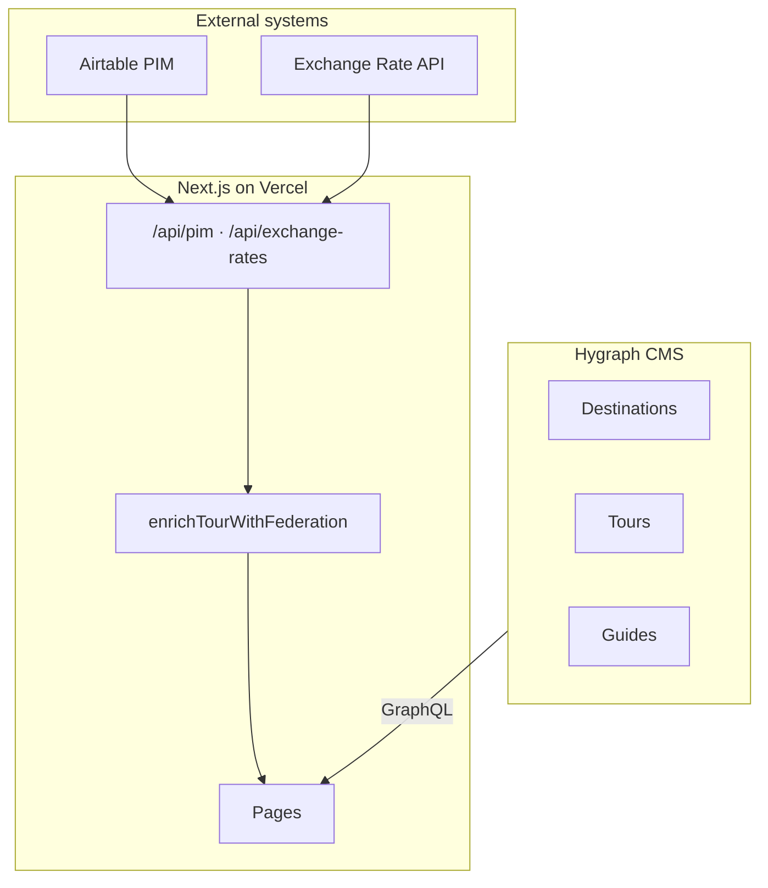
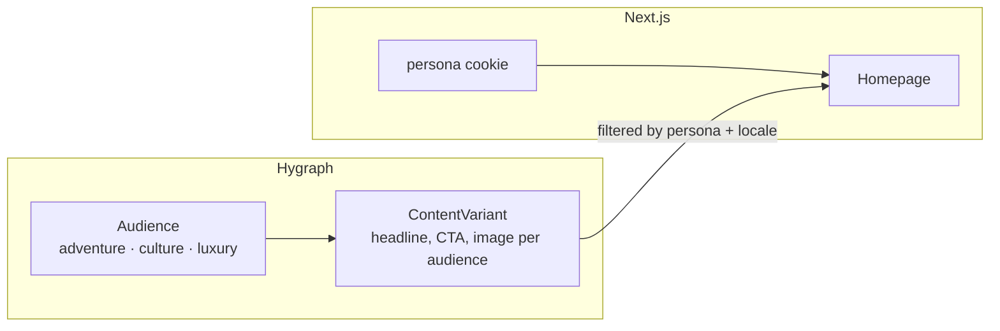

# Wandr — Project Plan

A Hygraph reference project demonstrating localization, live preview, click-to-edit, content federation, and (planned) personalization via audience-based content variants.

**Repo:** [github.com/Kaihkashan1/wandr](https://github.com/Kaihkashan1/wandr)  
**Deployed:** Vercel (`wandr-showcase.vercel.app`)

---

## Capability status

| Capability | Status | Notes |
|---|---|---|
| Localization | ✅ Done | EN / DE / FR / ES — content + UI strings |
| Live preview | ✅ Done | Draft Mode, Hygraph Studio iframe, tunnel docs |
| Click-to-edit | ✅ Done | `@hygraph/preview-sdk` data attributes on server |
| Content stages | ✅ Done | Stage badges in preview mode |
| App-level federation | ✅ Done | PIM + exchange rates joined in Next.js |
| Airtable PIM | ✅ Done | Optional external PIM with mock fallback |
| Hygraph Remote Sources | 🔜 Planned | `/api/pim` ready; Hygraph schema not wired yet |
| Persona personalization | 🔜 Planned | README describes it; not implemented yet |

---

## Completed work

### 1. Core platform

- **Next.js 15** App Router, React 19, TypeScript, Tailwind CSS
- **Hygraph** as headless CMS for destinations, tours, and travel guides
- GraphQL client with CDN + draft endpoint resolution at request time (`src/lib/hygraph.ts`)
- Static generation for slug pages (`generateStaticParams`) with ISR where needed
- Deployed to **Vercel** with env vars for Hygraph, preview, and optional Airtable

**Key env vars:**

| Variable | Purpose |
|---|---|
| `HYGRAPH_ENDPOINT` | Content API CDN URL |
| `HYGRAPH_TOKEN` | Permanent auth token (published content) |
| `HYGRAPH_PREVIEW_TOKEN` | PAT with DRAFT stage for live preview |
| `NEXT_PUBLIC_HYGRAPH_STUDIO_URL` | Studio URL for click-to-edit |
| `AIRTABLE_API_KEY` / `AIRTABLE_BASE_ID` | Optional external PIM |

---

### 2. Localization

**What works:**

- Locale switcher in nav (`LocaleSwitcher`) — EN, DE, FR, ES
- `locale` cookie persisted via `POST /api/preferences` and middleware (`?locale=` query param in preview)
- All Hygraph queries pass `locales: [$locale, en]` with English fallback
- UI strings in `src/lib/i18n.ts` (~400 keys × 4 locales)
- Locale-aware date and money formatting (`src/lib/locale.ts`)
- Locale → currency mapping: EN → USD, DE/FR/ES → EUR

**Files:**

- `src/components/ui/LocaleSwitcher.tsx`
- `src/lib/locale.ts`, `src/lib/i18n.ts`, `src/lib/request-locale.ts`
- `src/app/api/preferences/route.ts`
- `src/middleware.ts` (sets locale cookie from preview URL)

---

### 3. Live preview

**What works:**

- `GET /api/preview` activates Next.js Draft Mode and redirects to the content page
- `GET /api/preview/disable` exits preview
- Draft content fetched via `HYGRAPH_PREVIEW_TOKEN` and `api-*.hygraph.com` v2 endpoint
- Preview works on Vercel and locally (direct URL); Hygraph Studio iframe requires HTTPS tunnel for localhost
- Middleware sets `x-wandr-preview` header and `Cache-Control: no-store` for preview requests
- `frame-ancestors` CSP allows Hygraph Studio to embed the site
- CORS headers for `*.hygraph.com` origins (Studio iframe + Local Network Access)
- Locale driven by `?locale=` in preview URL (no duplicate locale bar in preview)
- `publishedAt` null on draft guides handled gracefully

**Preview URL format (Hygraph Studio):**

```
https://wandr-showcase.vercel.app/api/preview?slug={slug}&model=destination&locale={locale}
```

**Local tunnel:**

```bash
pnpm dev          # port 3000
pnpm dev:tunnel   # cloudflared → use tunnel URL in Hygraph preview settings
```

**Files:**

- `src/app/api/preview/route.ts`, `src/app/api/preview/disable/route.ts`
- `src/lib/preview.ts`, `src/lib/preview-utils.ts`
- `src/middleware.ts`
- `src/components/preview/PreviewWrapper.tsx`

---

### 4. Click-to-edit

**What works:**

- `@hygraph/preview-sdk` integrated
- `<EditableField>` renders `data-hygraph-*` attributes on the **server** (required for Vercel preview)
- Wrapped fields on destination and guide pages: title, tagline, description, body, quick facts components
- Rich text fields annotated with `data-hygraph-rich-text-format`
- Clicking a field in preview jumps to that field in Hygraph Studio sidebar

**Files:**

- `src/components/preview/EditableField.tsx`
- `src/app/destinations/[slug]/page.tsx`
- `src/app/guides/[slug]/page.tsx`
- `src/components/ui/QuickFactsCard.tsx`

---

### 5. Content stages

- `<StageBadge>` shows Draft / In review / Published on preview pages
- Stage passed from Hygraph GraphQL `stage` field

---

### 6. App-level content federation

Tour pages combine editorial content (Hygraph) with operational data (PIM + exchange rates) at request time.

**Architecture:**

```
Hygraph (tour content)
    ↓
getTourBySlug() → enrichTourWithFederation()
    ↓                    ↑
Tour page          PIM (pricing + availability)
                   Exchange rates (currency conversion)
```

**PIM data sources (priority order):**

1. **Airtable** — if `AIRTABLE_API_KEY` + `AIRTABLE_BASE_ID` set
2. **Mock fallback** — hardcoded in `src/lib/federation/pim.ts`

**Airtable setup:**

- Base with `Pricing` and `Departures` tables
- `tourId` column matches Hygraph tour slug (e.g. `kyoto-culture-5d`)
- Seed script: `pnpm seed:airtable` (creates tables + inserts CSV data)
- Import CSVs: `scripts/airtable/pricing.csv`, `scripts/airtable/departures.csv`

**Exchange rates:**

- Free public API (`open.er-api.com`) by default
- Optional `EXCHANGERATE_API_KEY` for higher quotas
- Cached 1 hour in production; no cache in dev

**Caching (PIM):**

- Dev: no cache — Airtable edits reflect immediately
- Production: 60s revalidation on tour pages and Airtable fetches

**API endpoints (stand-ins for Hygraph Remote Sources):**

| Endpoint | Returns |
|---|---|
| `GET /api/pim?tourId={slug}` | `{ pricing, availability }` |
| `GET /api/exchange-rates?base=EUR` | `{ base, rates, updatedAt }` |

**UI:**

- `TourPricingCard` — converted price, original-price footnote, exchange rate, upcoming departures
- Displays `spotsRemaining` (not `spotsTotal`) per departure row

**Files:**

- `src/lib/federation/index.ts` — join + currency conversion
- `src/lib/federation/pim.ts` — PIM entry point
- `src/lib/federation/airtable.ts` — Airtable REST client
- `src/lib/federation/exchange-rates.ts` — FX rates
- `src/app/api/pim/route.ts`, `src/app/api/exchange-rates/route.ts`
- `src/components/ui/TourPricingCard.tsx`
- `docs/federation.md` — federation overview and Airtable setup

---

### 7. Build and deploy fixes

- Removed accidentally committed `.next` build artifacts from git (95 files)
- Hygraph endpoints resolved at request time (fixes preview on Vercel)
- `HYGRAPH_ENDPOINT` validation rejects Vercel URLs mistaken for Hygraph URLs
- Production build verified with Hygraph env vars on Vercel

---

### 8. Documentation

| Doc | Contents |
|---|---|
| `docs/federation.md` | Federation pattern, Airtable setup, key files |
| `.env.local.example` | All env vars with preview URL templates and tunnel notes |
| `README.md` | Getting started, capability overview (some items ahead of implementation) |

---

## Current architecture



**Data ownership:**

| Data | Owner | Edited by |
|---|---|---|
| Tour copy, images, SEO | Hygraph | Content team |
| Prices, departures | Airtable (or mock) | Ops / revenue |
| Currency display | Exchange rate API | Automatic |
| UI strings | `src/lib/i18n.ts` | Developers |

---

## Upcoming: Hygraph Remote Sources

**Goal:** Move the PIM join from Next.js into Hygraph so tour content + pricing resolve in a **single GraphQL query**. Hygraph calls our API as a REST remote source.

### Why

- Marketers can preview federated data in Hygraph Playground
- One API for frontend (and other consumers)
- Demonstrates Hygraph Content Federation natively

### Prerequisites

- [x] Public API endpoints exist (`/api/pim`, `/api/exchange-rates`)
- [x] App deployed to Vercel with Airtable configured
- [ ] Hygraph Remote Source configured in schema
- [ ] REST remote field added to `Tour` model
- [ ] Frontend query updated to use remote field (optional — can keep app-level join during transition)

### Step 1 — Configure Remote Source in Hygraph

**Schema → Remote Sources → Add:**

| Field | Value |
|---|---|
| Display name | `Wandr PIM` |
| Type | REST |
| Base URL | `https://wandr-showcase.vercel.app` |

**Custom type definitions (SDL):**

```graphql
type TourPricing {
  tourId: String
  basePrice: Float
  currency: String
  discountedPrice: Float
  pricePerPerson: Boolean
}

type TourAvailability {
  tourId: String
  date: String
  spotsTotal: Int
  spotsRemaining: Int
  status: String
}

type PimData {
  pricing: TourPricing
  availability: [TourAvailability]
}
```

### Step 2 — Add REST remote field on Tour

| Setting | Value |
|---|---|
| Remote source | `Wandr PIM` |
| Method | GET |
| Path | `/api/pim?tourId={{doc.slug}}` |
| Return type | `PimData` |

### Step 3 — Verify in Hygraph Playground

```graphql
query {
  tour(where: { slug: "kyoto-culture-5d" }) {
    title
    pimData {
      pricing { basePrice currency }
      availability { date spotsRemaining status }
    }
  }
}
```

### Step 4 — Update Next.js (optional refactor)

- Extend `GET_TOUR_BY_SLUG` in `src/lib/queries.ts` to request `pimData` remote field
- Simplify `getTourBySlug()` — use Hygraph response instead of `enrichTourWithFederation()` for pricing/availability
- Keep `enrichTourWithFederation()` for **currency conversion** (locale → USD/EUR) since that is app-level logic

### Step 5 — Exchange rates remote source (optional)

Second remote source pointing at `/api/exchange-rates?base=EUR` with `ExchangeRates` custom type. Likely a top-level Query field rather than per-tour.

### Deliverables

- [ ] `docs/remote-sources.md` — Hygraph setup guide
- [ ] Remote field on `Tour` in Hygraph schema
- [ ] Playground query verified
- [ ] (Optional) Frontend refactored to consume remote field
- [ ] Demo script: edit Airtable → Hygraph Playground shows new price → tour page reflects it

---

## Upcoming: Personalization

**Goal:** Different visitors see different homepage hero content based on travel persona (adventure, culture, luxury). Marketers control variants in Hygraph — no deploys.

### Current state

- **Locale personalization** ✅ — language, currency, date formats
- **Persona personalization** ❌ — described in README but not built
  - No `persona.ts`
  - No persona switcher in nav
  - Homepage hero uses static `t(locale, "heroTitle")` strings

### Planned architecture (Layer 2 — Persona)



### Hygraph schema to add

**Audience model:**

| Field | Type |
|---|---|
| `name` | String |
| `slug` | String (unique) — `adventure`, `culture`, `luxury` |

**ContentVariant model:**

| Field | Type |
|---|---|
| `audience` | Relation → Audience |
| `headline` | String (localized) |
| `subheadline` | String (localized) |
| `ctaLabel` | String (localized) |
| `ctaHref` | String |
| `heroImage` | Asset |

Link variants to homepage (relation or dedicated `Homepage` singleton model).

**Seed content:** 3 personas × 4 locales = 12 variants.

### App changes

| Task | File(s) |
|---|---|
| `resolvePersona()`, `PERSONAS` list | `src/lib/persona.ts` (new) |
| Persona switcher in nav | `src/components/ui/PersonaSwitcher.tsx` (new) |
| Set `persona` cookie | `src/app/api/preferences/route.ts` |
| Fetch variant by persona + locale | `src/lib/fetchers.ts`, `src/lib/queries.ts` |
| Homepage reads variant | `src/app/page.tsx` |
| UI strings for persona labels | `src/lib/i18n.ts` |

### What NOT to personalize (for demo scope)

- Tour / destination detail pages — keep stable for SEO and preview demo
- PIM pricing — operational truth, not editorial
- Full recommendation engine — out of scope

### Future layer (optional — Layer 3)

| Signal | Effect |
|---|---|
| Preferred region (cookie) | Sort destinations/tours |
| Budget range | Filter by PIM `basePrice` |
| Travel dates | Highlight matching departures |
| Recently viewed | "Continue exploring" prompts |

### Deliverables

- [ ] Hygraph `Audience` + `ContentVariant` models and seed content
- [ ] `src/lib/persona.ts` + `PersonaSwitcher`
- [ ] Homepage hero driven by ContentVariant
- [ ] Update README to match actual implementation
- [ ] Demo script: switch persona → hero changes instantly

---

## Suggested implementation order

1. **Remote Sources** — endpoints exist; mostly Hygraph schema + Playground verification
2. **Persona personalization** — new Hygraph models + homepage refactor
3. **Frontend remote field refactor** — simplify federation layer once Remote Sources proven
4. **Layer 3 contextual personalization** — if time allows

---

## Demo talking points

**Federation:**
> "Tour pages are built from Hygraph, but price and availability live in Airtable. We federate that data at render time and convert currency by locale. Hygraph Remote Sources can resolve the same PIM data in a single GraphQL query."

**Personalization (once built):**
> "Locale personalizes language and currency. Persona personalizes the story — adventure vs culture vs luxury. Federation personalizes the offer — live price and availability. Three systems, one page."

---

## Key files reference

```
src/
  app/
    page.tsx                         # Homepage (persona target)
    tours/[slug]/page.tsx            # Federated tour detail
    api/pim/route.ts                 # PIM remote source endpoint
    api/exchange-rates/route.ts      # FX remote source endpoint
    api/preferences/route.ts         # Locale (and future persona) cookies
    api/preview/route.ts             # Live preview entry
  lib/
    federation/                      # App-level federation layer
    hygraph.ts                       # GraphQL client
    fetchers.ts                      # Data fetching
    locale.ts                        # Locale + currency
    i18n.ts                          # UI translations
    preview.ts                       # Preview helpers
  components/
    ui/LocaleSwitcher.tsx
    ui/TourPricingCard.tsx
    preview/EditableField.tsx
docs/
  federation.md
scripts/
  seed-airtable.mjs
  airtable/pricing.csv
  airtable/departures.csv
```
